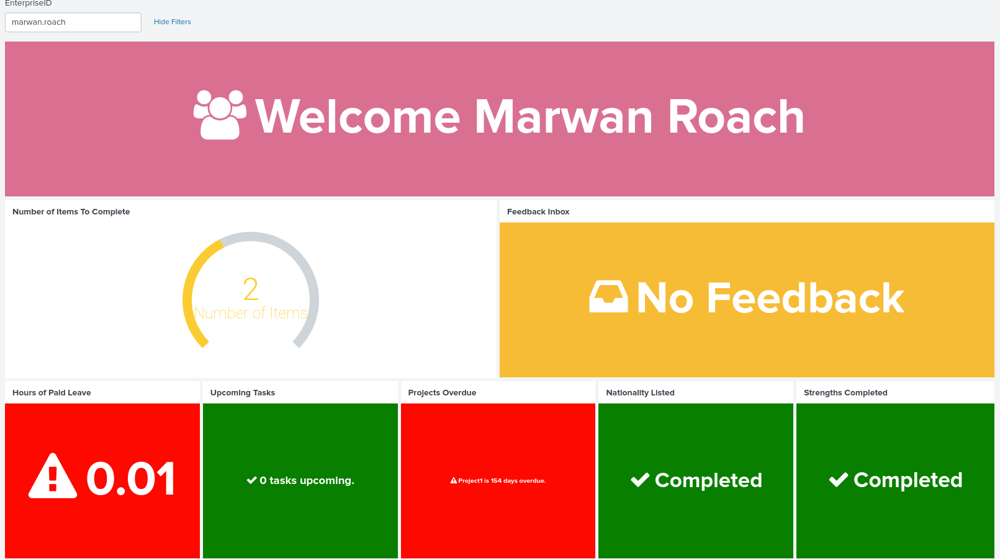

# Accenture_Bootcamp
## Dashboard built off of splunk
Provides users a list of tasks that need to be completed. Chatbot and dashboard work off same database. Users with more than 3 tasks are pinged by the chatbot and linked to their dashboard.

Html conversion of XML code added, video of chatbot demo linked below as well as presentation given on the day. 

